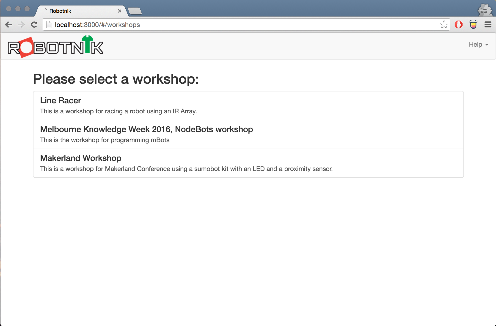
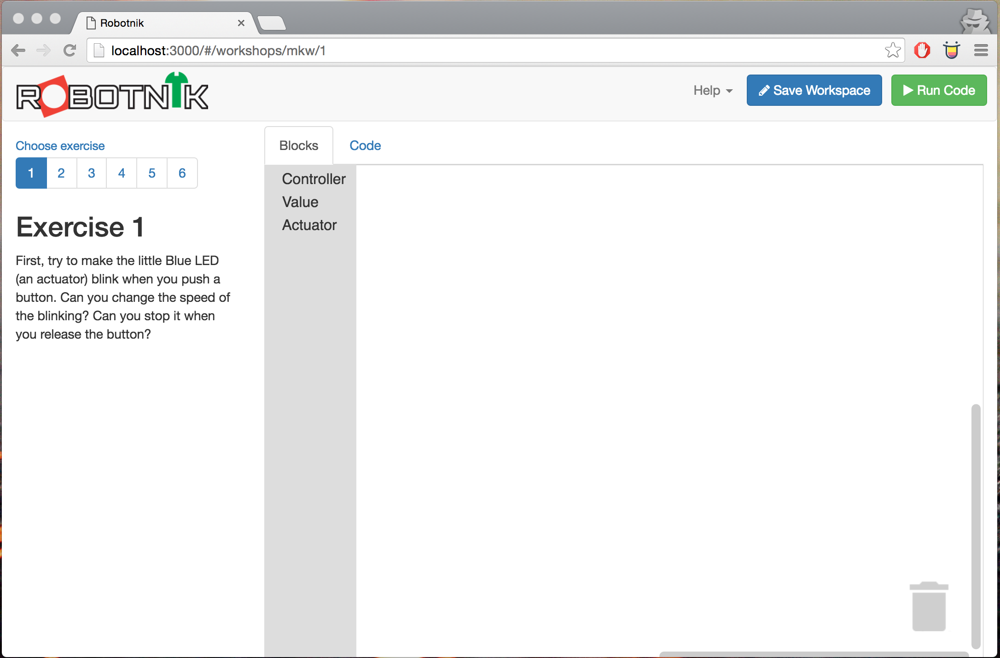
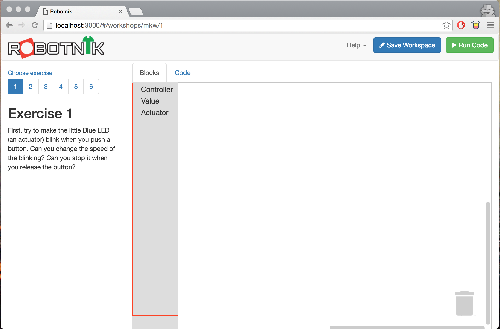
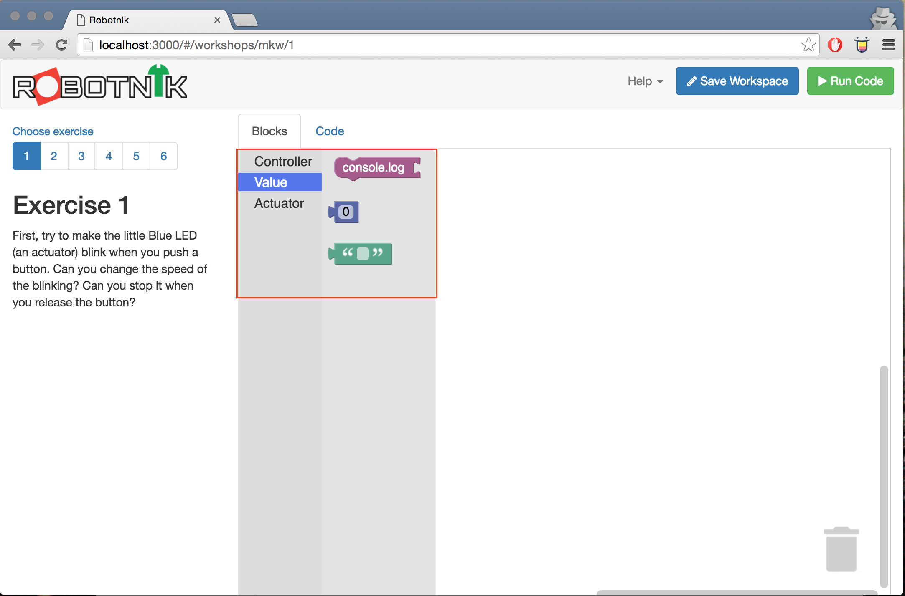
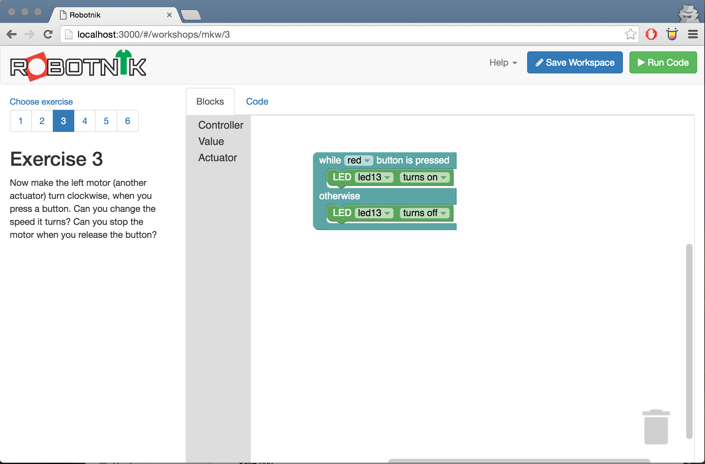
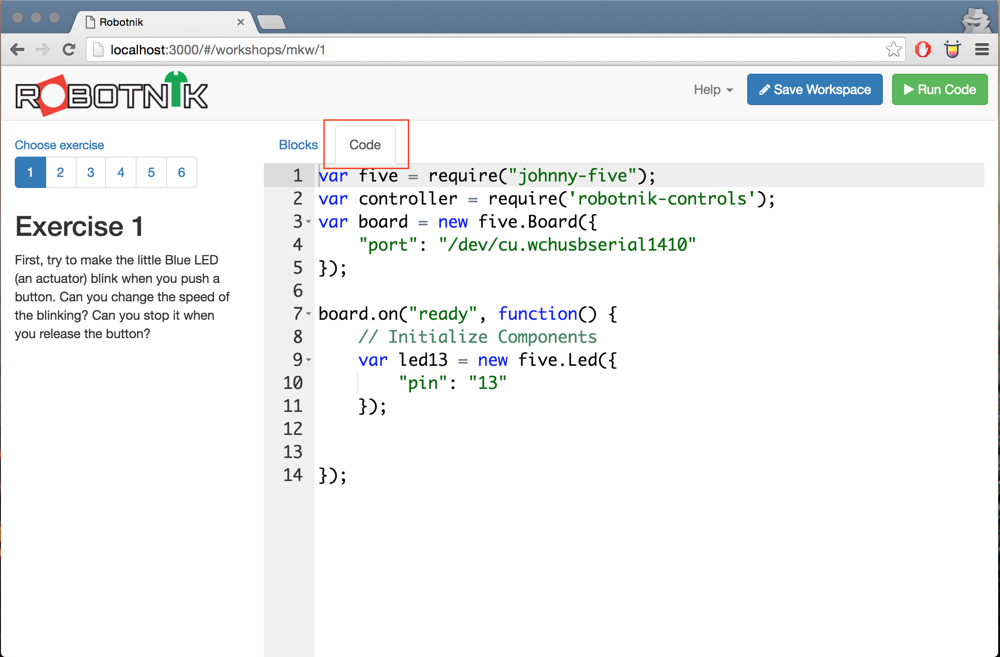
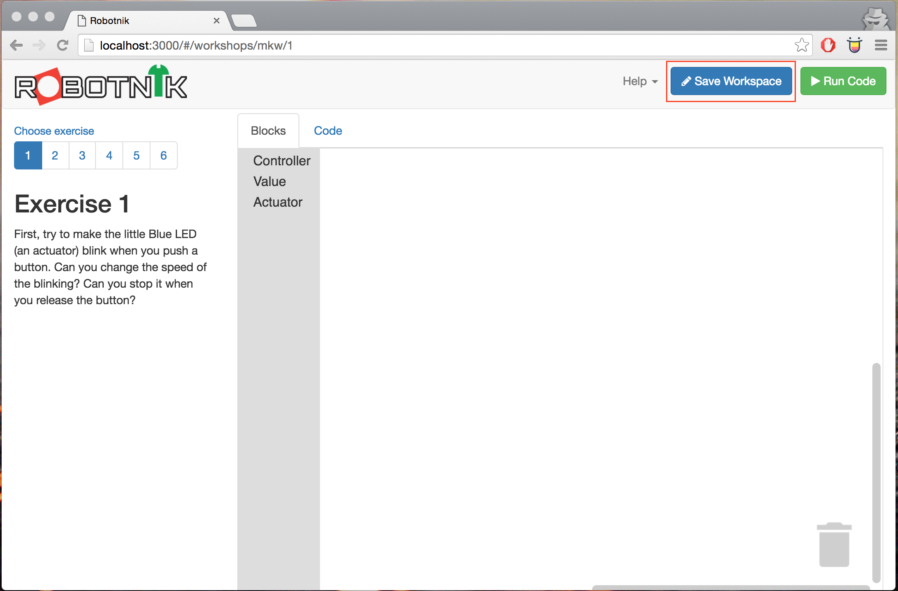
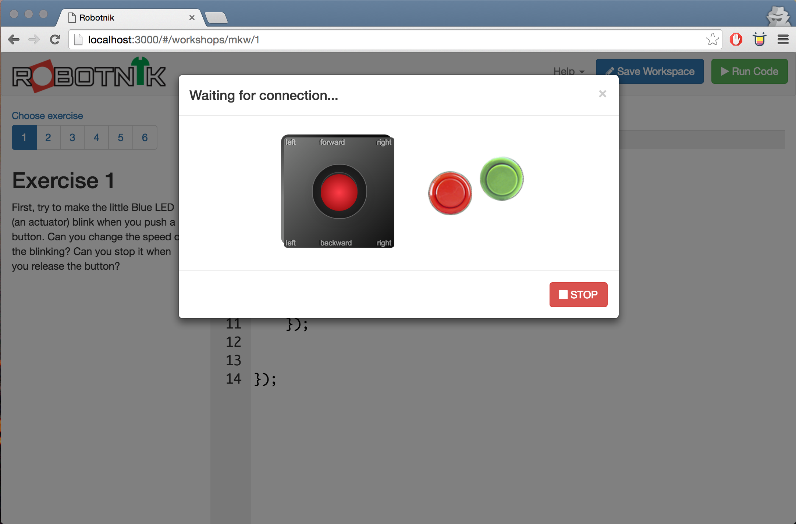
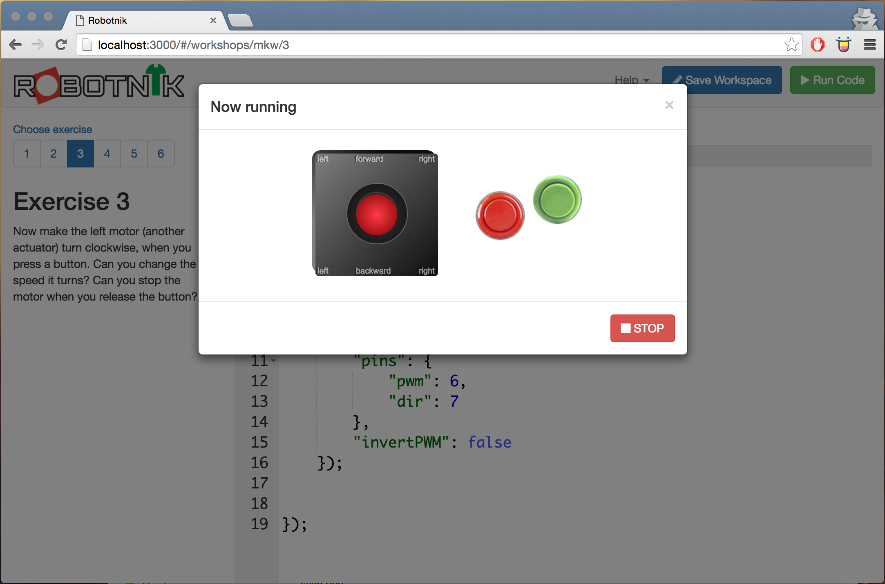

# Robotnik workshop notes

This folder has a wealth of information about the robotnik kit we're working
with including information about how the basic circuits work, some thoughts
around any physical build requirements you may have and then some examples as
well.

This guide will show you the basics of using robotnik. The other guides will
walk you through other aspects of the workshop.

* [Electronic Circuits](./electronics/README.md)
* [Physical build](./physical/README.md)
* [JS code examples for Robotnik Exercises](./code/README.md)

## Quick view

The gif below will show you a super fast view of how the interface works. The
rest of this readme guide will explain it in detail.


## Running robotnik

This should be up and running on your machine. You can tell if it's working
by running http://localhost:3000 from your development machine. If it's working
you'll see the workshop selection screen.



Choose the workshop and you'll drop into Exercise 1 with your code workspace.



The key aspects of the workspace are highlighted below.

### Exercises

Exercises can be selected from the list on the left. They have instructions
as to the goals and an exercise will determine what components you have
available to build with.


### Toolbox

Inside the workspace is the toolbox. This toolbox has components that you can
drag onto the main window to compose your code.



Select a category of blocks you want to choose from and you can see the available
blocks.



Then grab a block and drag it to the main workspace.



### Code view

If you want to look at the code you're producing, hit the code button and you
will see all the javascript your blocks are making.



### Saving your code

To save your code select the save workspace button on the top right. It's a
good idea to do this once in a while.



### Running your code

To run your code hit the run code button and your code will launch on the
device.


Whilst the board initialises your controls will show "Waiting for connection".



Once complete it will say "Board running"



Now you can control your program using the joystick or buttons to create events.
Also note that the "R" and "G" keys on your keyboard can be used to "press" the
Red and Green buttons as can the arrow keys to simulate the joystick.

## Running the robotnik server

If the Robotnik server is not running do the following:

Open a terminal and:

```
cd ~/dev/robotnik
node run webserver
```

You should now be able to visit http://localhost:3000 and the robotnik server
will run.
