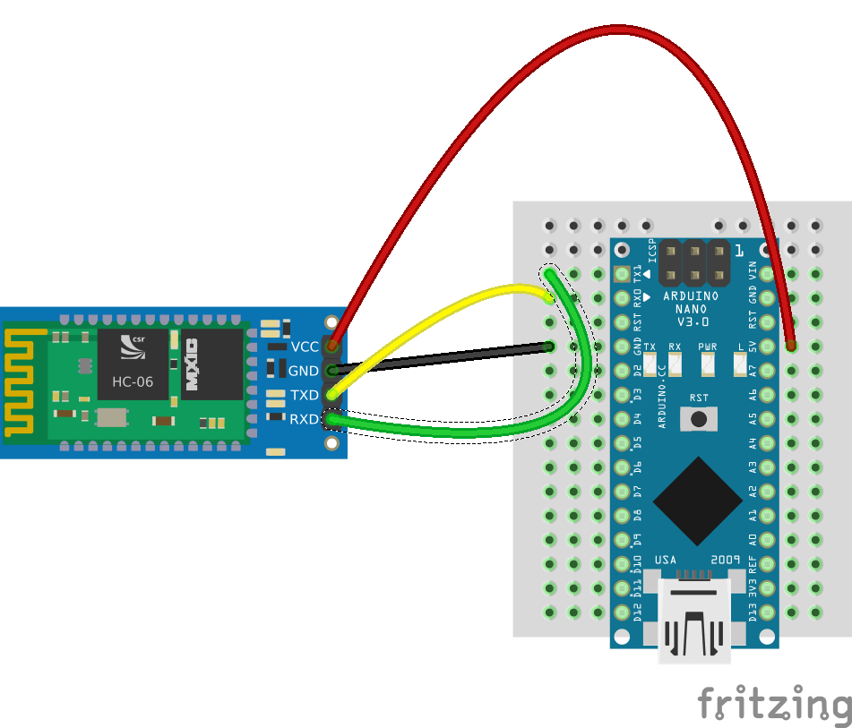
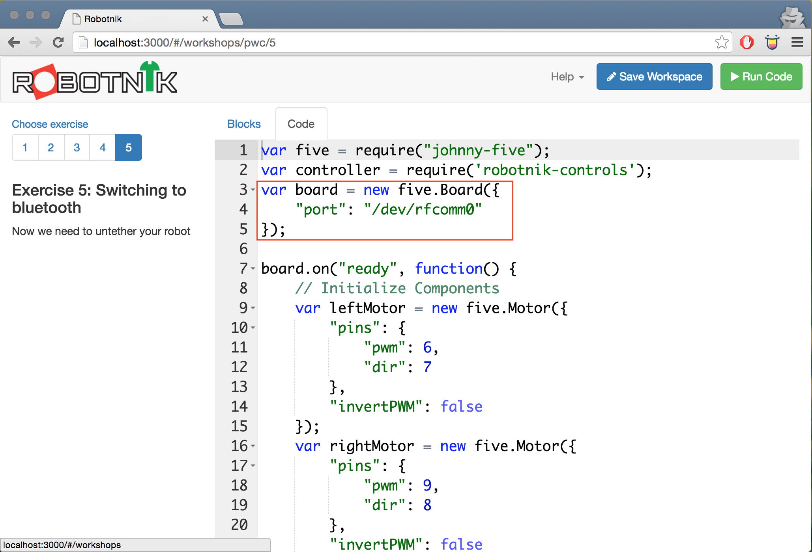

# Exercise 5: Going bluetooth

This exercise assumes you have your robot working and you're simply looking to
make it bluetooth enabled. In this case, bluetooth is going to be used to replace
the USB cable over what's called Bluetooth Serial.

All the pairing and everything has already been done so all you need to do is
wire the bluetooth module up.

*Note that it's really important to check your wiring. You can easily wreck your
bluetooth module if you wire it back to front*

## Build the circuit

### Requirements

* 1x Arduino
* 1x Bluetooth module
* Jumper wires

Disconnect the USB cable and put it to one side then add the circuit below to
your existing design.

## Build the code in Robotnik

Using this exercise, it will set the port in the code to use the bluetooth
module instead of USB which is the default. We have to tell it which module to
use however which is why we need a new exercise.

You can see the code that changes in the image below.

## Going further

One of the big things you make need to consider is power. If you're having issues
then you might need a second battery pack to deal with the current draw.

Consider powering the Bluetooth and arduino from one pack and your motors and
servos from another (probably the AA batteries).

<!--- pandoc commands --->
\newpage
