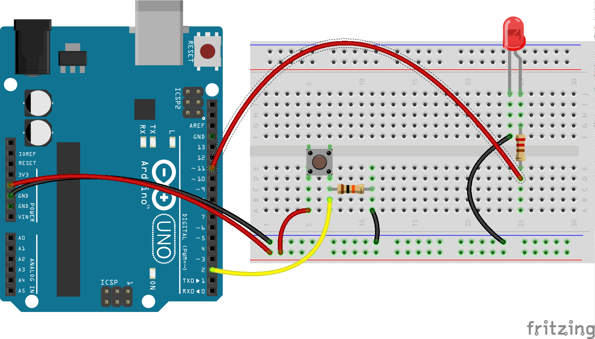

# Exercise 5: Light switch

Buttons are very handy objects that can be used to switch things on and off
or else as inputs (eg the instruction to jump in a game).

In this exercise we'll take the input from the physical button and then use
that to turn an LED on and off.

## Build the circuit

### Requirements

* 1x LED
* 1x Arduino
* 1x 220 resistor
* 1x pushbutton
* 1x 10K resistor
* Jumper wires

## Build the code in Robotnik

By this point you should have a good handle on how this works so we'll leave
this one as an exercise for you to complete. Any questions, please ask!

<!--- pandoc commands --->
\newpage
