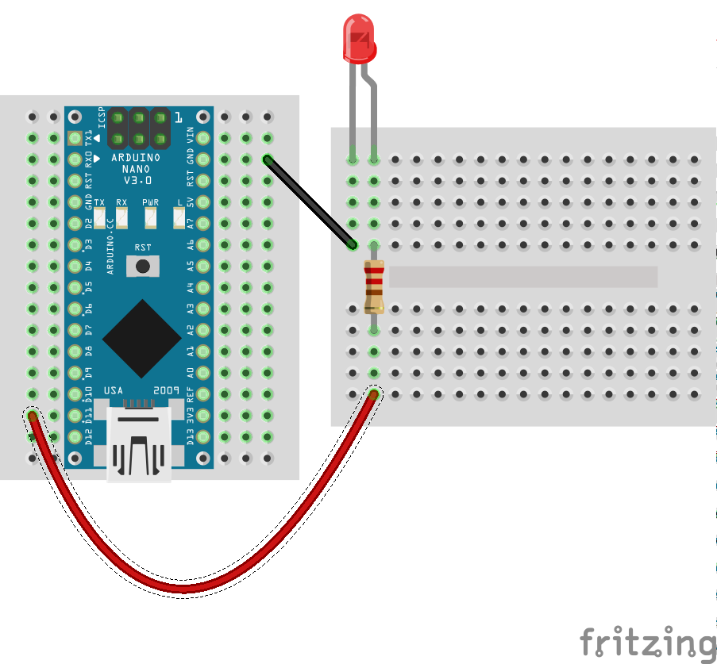
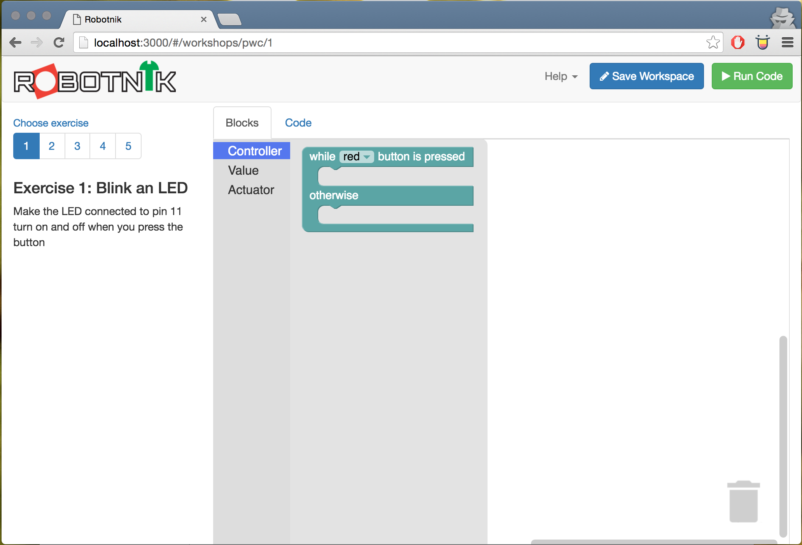
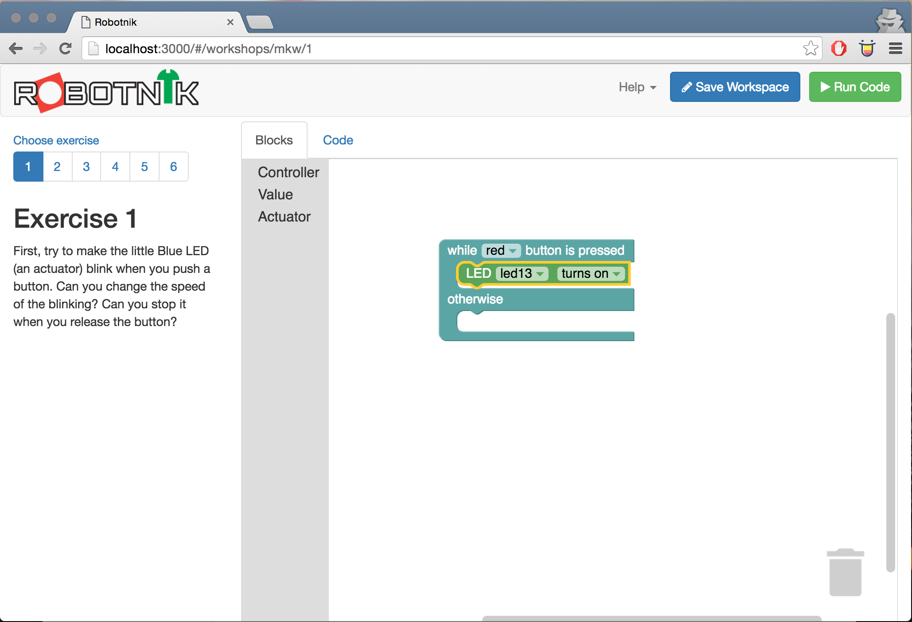
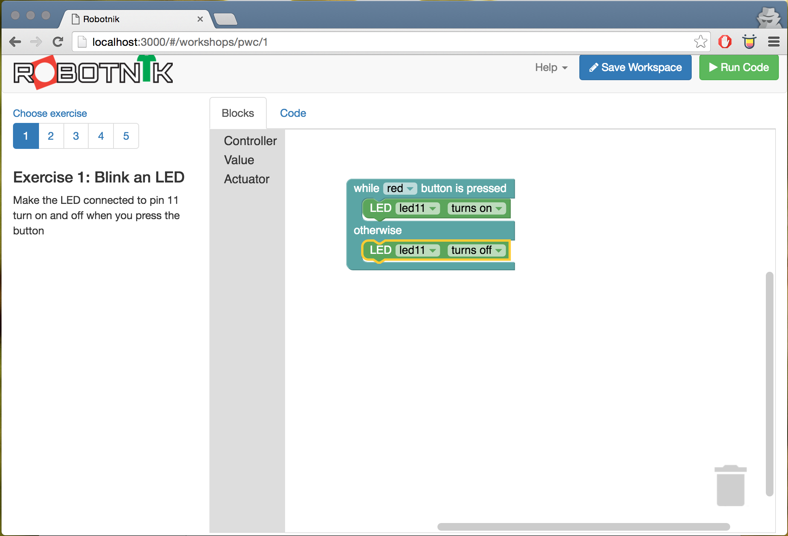

# Exercise 1: Blinking an LED

An LED is a common method of creating light in a project. They come in a huge
variety of colours and sizes.

In this exercise you'll blink an LED under software control. Blinking an LED
is an important "Hello World" type example of how to use hardware as the
circuit is very simple but being able to control a physical thing by using
software illustrates many of the core concepts. Once you can do this then
you can control other things in your environment as well.

## Build the circuit

### Requirements

* 1x Resistor (any size will do but the bigger the less bright it will be)
* 1x LED
* 1x Arduino
* 1x breadboard
* Jumper wires

Build the circuit below, taking care to note that an LED has polarity. This means
it only works in one direction. The "long" leg is the positive side and it
connects to your source of power through the resistor (which slows the flow of
current and stops the LED from burning out). The "short" leg is the negative
side and it is connected to ground.



Make sure the LED is connected to pin 11.

Once you've built the circuit, it's time to program it.

## Build the code in Robotnik

Select the `Controller` from the toolbox then grab the controller block and drop
it onto the workspace. By default it's wired up to the "red" button however you
can change that to another button or the joystick controller if you want.



Next select `Actuator` from the toolbox and add the LED block onto the workspace
and connect it into the top of the controller press event block.



When the button is pressed, this will turn the LED ON which is what we want
to happen. After that we add another LED block but this time change it's state
to turn off instead.



That's looking pretty good. Save your workspace, run it and you should now
be able to press the red button on the controller and it will turn your LED on.
When you release the button it should turn it off.

## Build code in JavaScript

To build a similar circuit in javascript to run from a console we can use an
script such as the following.

```javascript
var five = require("johnny-five");

var board = new five.Board();

board.on("ready", function() {

  // Create a standard `led` component instance
  var led = new five.Led(11);

  led.blink(500);
});
```

Make sure you have the Johnny-Five package installed and you can run it from
the command line with

```
node code/led.js
```

## Going further

Other things you can do:

* Try out other parts of the `Led` API such as blinking and stopping
* Pin 11 is a "PWM" pin which means you can use it to simulate analog voltage
levels. Try out the fade part of the API.
* Move onto [Exercise 2 - Moving a Servo](./servo.md)

<!--- pandoc commands --->
\newpage
