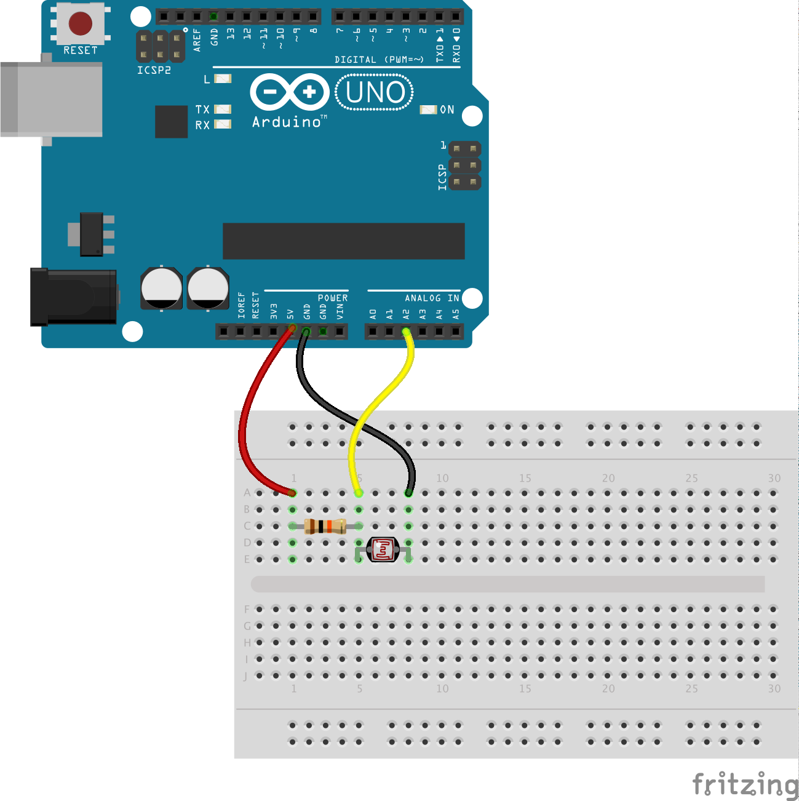

# Exercise 3: Read the light level

A light dependent resistor (LDR) is a great little device that can be used
to measure the amount of light falling onto it and outputting an analog
value.

In this exercise we'll output the value to the console and watch the data come
in on the terminal.

## Build the circuit

### Requirements

* 1x LDR
* 1x Arduino
* 1x 10K resistor
* Jumper wires

## Build the code in Robotnik

Select the `Sensor` from the toolbox and grab the lightSensor block and drop
it onto the workspace.

This block is an `Event` and allows you to take an action every time data comes
back from the `Sensor`.

In this case, we just add a `console.log` block and then the value from the
sensor as well.

When you run this code you should see the data values start appearing on the
terminal window outputing the value from the light sensor. What happens when you
put your hand back and forth?

## Going further

Other things you can do:

* Add an LED on pin 11 and see if you can turn the light on when it gets dark.

<!--- pandoc commands --->
\newpage
