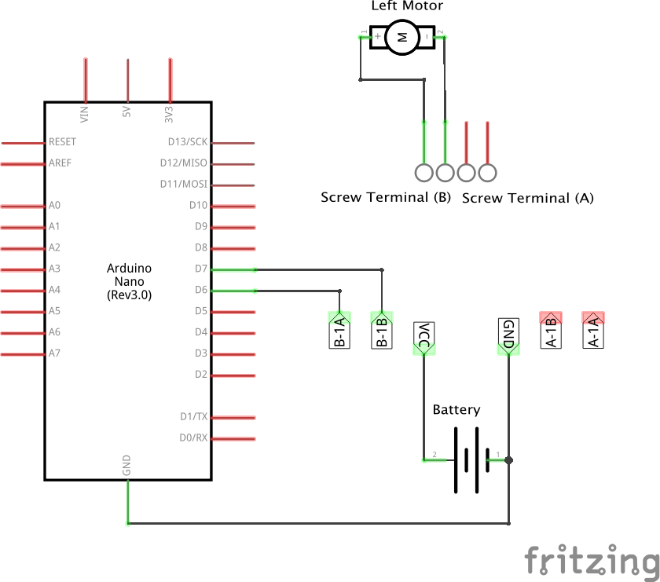

# Spinning a motor

A normal DC motor is great for turning wheels however they can draw a lot
of current. Far too much for an arduino to support. As such a motor
controller is used to manage the speed and direction of the motor.

In this exercise, you'll make a motor change directions based on the position
of the joystick.

## Build the circuit

### Requirements

* 1x DC Motor
* 1x Motor Controller
* 1x Battery pack
* 1x Arduino
* Jumper wires

The motor controller has two "channels" which can be used to control 2 different
DC motors. Each channel (labelled A and B) then has two pins used to control the
speed and direction of the motor. These are labelled "1A" and "1B" so you end up
with "A-1A", "A-1B" to control the A motor and "B-1A", "B-1B" to control the B
motor.

Finally, the motor wires are connected to the screw terminal for the channel you
are attaching them to.

Build the circuit below.




## Build the code in Robotnik

Select the `Controller` from the toolbox then grab the controller block and drop
it onto the workspace. This time we want to select the "Up" event and we want to
add another controller where we select the "Down" event.


Next select `Actuator` from the toolbox and add the Motor block onto the workspace
and connect it into the bottom of the "Up controller" press event block. Do the
same for the "Down controller" event block as well. Set both motor blocks to "Stop".


This will set the motors to stop when the joystick is returned to the "neutral"
or centre position.

Now, add motor blocks to the top part of the condition in each of the "Up" and
"Down" controllers that set the direction and speed of the motor. Set the up
one to turn clockwise at 255 speed and the down one to turn counter-clockwise
at 255 speed.


When you run this code you should be able to push the joystick up and down
and make the motor turn in different directions.

## Build code in JavaScript

To build a similar circuit in javascript to run from a console we can use an
script such as the following.

```javascript
// TODO

```

Make sure you have the Johnny-Five package installed and you can run it from
the command line with

```
node code/motor.js
```

When you run this code, if you press the up and down arrows you will change
the direction of the motor turning.

## Going further

Other things you can do:

* Make sure your motor is turning the right direction when you look at the wheel.
If it isn't, flip your motor wires around in the screw terminal to get it going
as you'd expect it to.
* Move onto [Exercise 4 - Control a wheeled robot](./robot.md)


