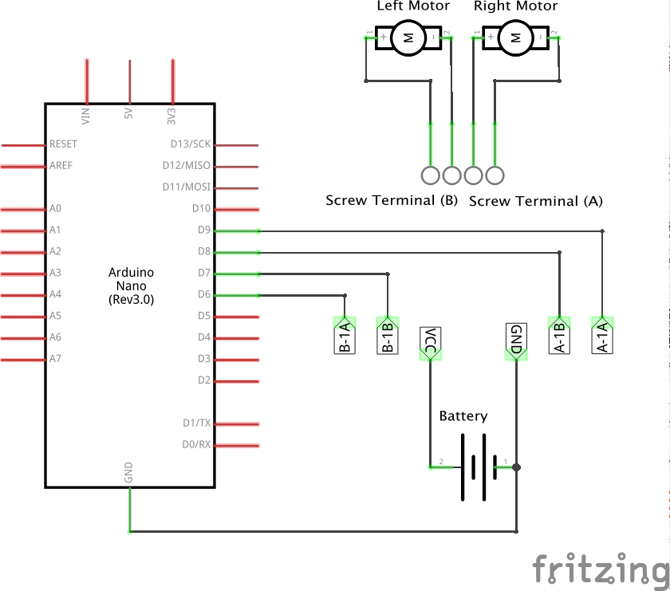
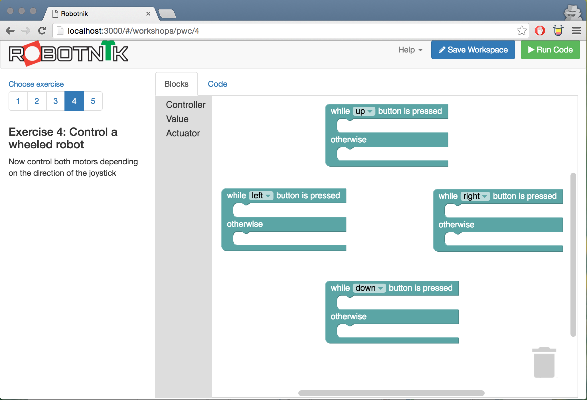
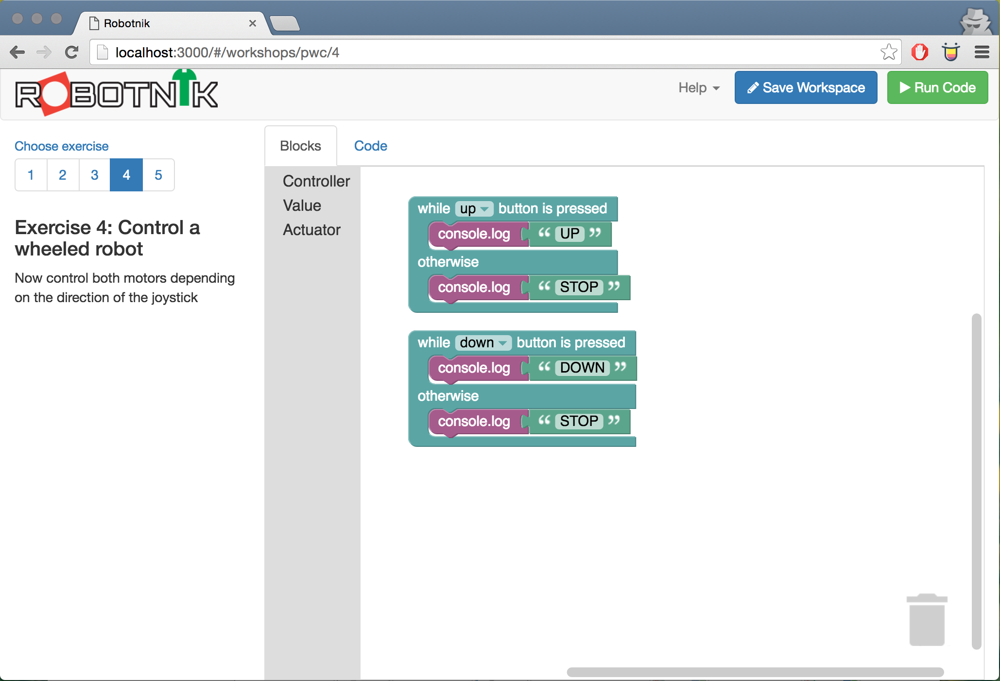
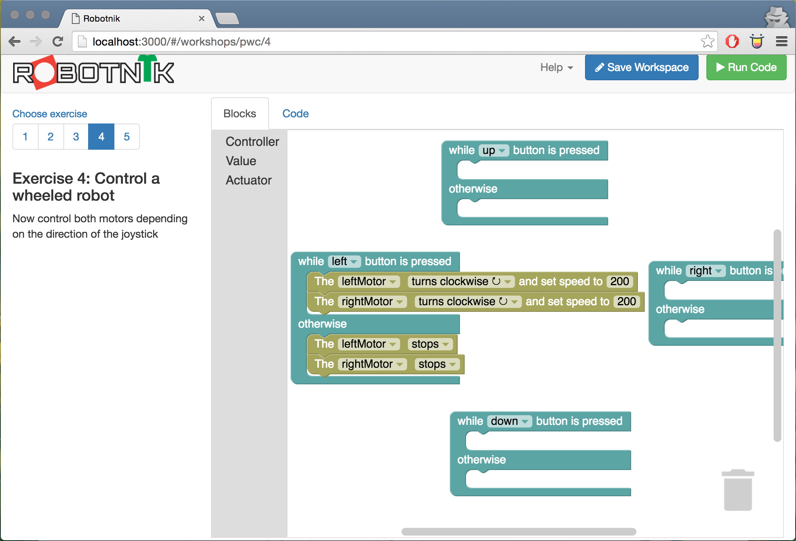

# Exercise 4 - Control a wheeled robot

Robots can take many different designs for locomotion. The design we'll use is
a classic that is well known and has been used in all sorts of robots since the
earliest days of robotics. This is known as a 2 Wheeled, Differential design.

How it works is that each of the wheels is connected to an independent motor which
can be used to drive its wheel forwards or backwards. This means that by combining
the directions of the two motors you can drive forwards, backwards and turn left
and right.

The left and right turns are often executed as pivots - eg by turning the left
wheel backwards whilst driving the right wheel forwards - however more sophisticated
turns can be achieved by slowing the speed of the "inside" wheel whilst keeping
the "outside" wheel constant. This is the way you would execute a turn around
a corner like you'd drive a car, rather than going to the middle of an intersection
and pivoting to the direction of the road you want to turn into.

In this exercise we'll execute a simple pivot which will be enough to illustrate
the concepts and you will be able to use the joystick or arrow keys to control
the robot.

## Build the circuit

### Requirements

* 2x DC Motors
* 1x Motor Controller
* 1x Battery pack
* 1x Arduino
* Jumper wires

It is assumed you worked through the [motor exercise](./motor.md) so please do
that if you haven't already. This circuit is an extension of that one where the
right motor uses the "A" channel for control connected to pins 8 and 9.

Build the circuit below.



## Build the code in Robotnik

It's assumed you're familiar with the way Robotnik works how so here's some tips
on how to build the control.

You need states to detect the up, down, left & right directions. You can also
lay them out on the workspace in a way that makes conceptual sense as well.



Before you think about your motors, get the states working. You can write
messages out to the console to make sure you're doing the right things at the
right time.



If you run this code you'll start to see messages print out to the terminal
window when you push the joystick up and down and when you release it. This is
a good way to ensure you have your input logic right and you don't even need
to wire anything up.

Next you can execute a pivot to the left. For this you turn both motors clockwise.
This will make the left side of the robot go backwards and the right side go
forwards, thus causing it to pivot towards the left.



Now you can turn left you can build the code to turn right and then to go forwards
and backwards using the same logic.

Try running the code after you work on each block so you can assess your work.

It's also easiest to work on things that are similar together eg turning right
is just the opposite of going left.

## Build code in JavaScript

Rather than repeat the code here, please see the robot.js file in the code
examples for a fully worked example.

Make sure you have the Johnny-Five package installed and you can run it from
the command line with

```
node code/robot.js
```

When you run this code, if you use the arrow keys you'll be able to control
the direction of the robot.

## Going further

Now it's time to take your skills to the ring where you'll battle others.

Think about your design and come up with your own Sumo bot. The aim is to push
the other opponent out of the ring or otherwise incapacitate it. You can only
make your robot up to 25x25x25cm in size but you can use any component you want
inside that volume.

When you're ready and you have your control design sorted, it's time to go
wireless and [switch to bluetooth](./bluetooth.md) to control your robot.

Pro tip: get your control system fully sorted before you go bluetooth. Going
wireless adds another layer of potential bugs so eliminate common problems like
your control system first before you introduce complexity.

