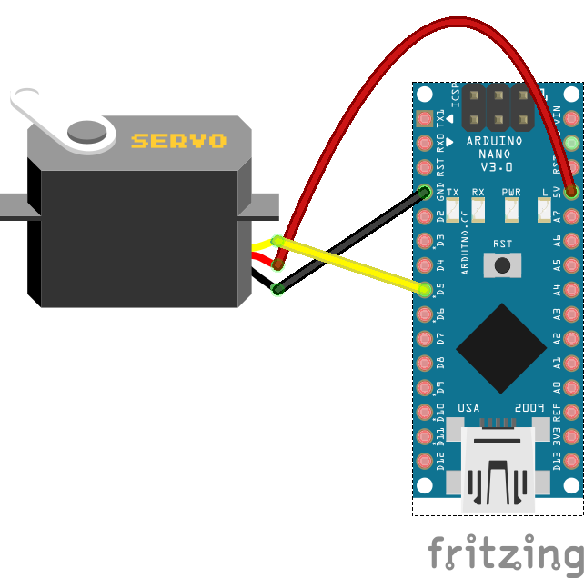
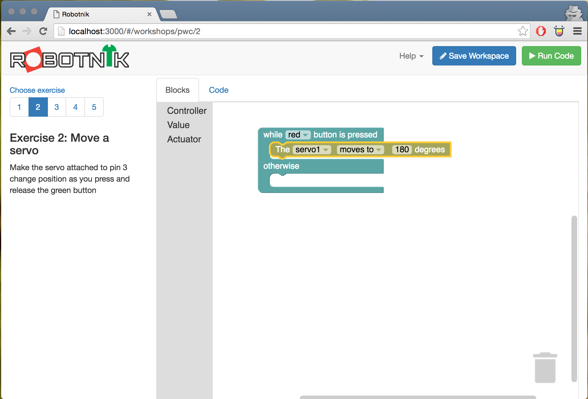
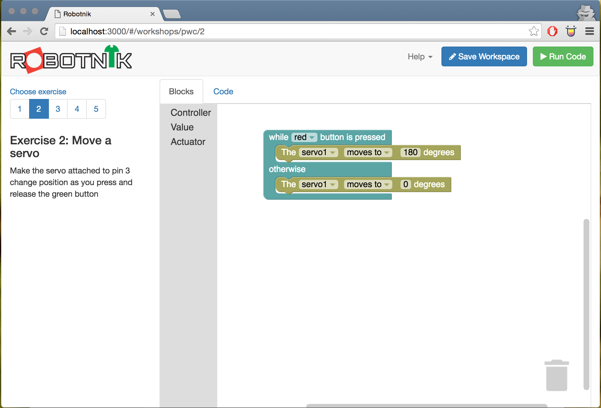

# Exercise 2: Moving a servo

A servo is a small motor that is has feedback on it to determine what position
it has rotated to. Servos are used in a lot of robotics due to high torque and
reasonable precision versus their cost.

In this exercise you'll move the servo to a position on the press of a button
and when it's released it will move back to it's starting position.

## Build the circuit

### Requirements

* 1x Servo
* 1x Arduino
* Jumper wires

A servo has 3 wires, voltage (usually red), ground (usually black or brown) and
signal (usually yellow or white). The servo is permanently powered through
voltage and ground and then the signal line is connected to a digital pin on
the arduino which sends messages to it to tell it where to move to.

Small servos like this one can be run from the arduino when this is the only
thing being powered but generally the power and ground would connect to a battery
instead.



Make sure the Servo is connected to pin 3.

## Build the code in Robotnik

Select the `Controller` from the toolbox then grab the controller block and drop
it onto the workspace. By default it's wired up to the "red" button however you
can change that to another button or the joystick controller if you want.


Next select `Actuator` from the toolbox and add the Servo block onto the workspace
and connect it into the top of the controller press event block.



When the button is pressed, this will move the servo to one extent of it's
arc - 180 degrees in this case (most servos can move 180 degrees of a circle).
When the button is released we want to move it back to 0 degrees.



When you run this code you should see the servo move through it's whole range
and back again when the servo is released.

## Build code in JavaScript

To build a similar circuit in javascript to run from a console we can use an
script such as the following.

```javascript
// Used from johnny-five.io examples

var five = require("johnny-five");
var readline = require("readline");

var rl = readline.createInterface({
  input: process.stdin,
  output: process.stdout
});

five.Board().on("ready", function() {
  var servo = new five.Servo(3);

  rl.setPrompt("SERVO TEST (0-180)> ");
  rl.prompt();

  rl.on("line", function(line) {
    servo.to(+line.trim());
    rl.prompt();
  }).on("close", function() {
    process.exit(0);
  });
});
```

Make sure you have the Johnny-Five package installed and you can run it from
the command line with

```
node code/servo.js
```

Once run, you'll be able to put in a number on the command line and the servo
will move to this position.

## Going further

Other things you can do:

* Try creating hinges and attachments to the servo arms so you can use a small
but rapid movement of the servo and amplify it to make a "flipper"
* Add another servo on pin 4 and see if you can use them together.
* Move onto [Exercise 3 - Spinning a Motor](./motor.md)

<!--- pandoc commands --->
\newpage
