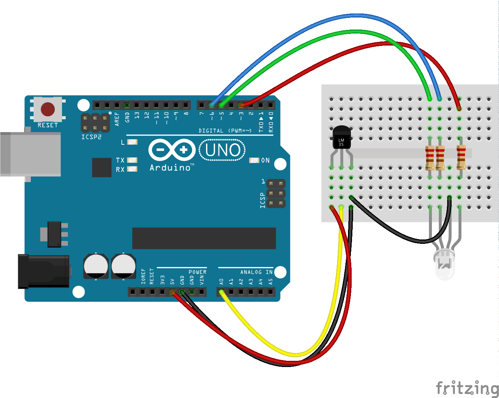

# Exercise 4: Temperature Light

A temperature sensor is a tiny thermometer and is good for, well, measuring
the temperature. By now you should have a good grasp of how Robotnik works - if
not then please review the previous exercises.

In this exercise we'll take data from the Temperature `Sensor` and then check
it against a set of conditions to change the colour of an RGB LED.

## Build the circuit

### Requirements

* 1x LM 35 Temperature sensor
* 1x RGB LED
* 1x Arduino
* 3x 220 resistor
* Jumper wires

## Build the code in Robotnik

This exercise is a little more delf directed but the key points are:

* The Temperature sensor data event is in the `Sensor` toolbox
* When you receive data you want to logically compare the `Value` of the sensor
against a particular number eg < 20, > 30 etc.
* For each condition, you can set the RGB LED value to a different colour from
the colour picker.
* You can change the shape of the `If` block by clicking the cog.

<!--- pandoc commands --->
\newpage
