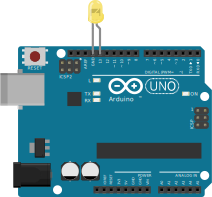

# Workshop:<br/> STEM TODO
<!-- .slide: class="title" -->

PWC Melbourne<!-- .element: class="location" -->

Andrew Fisher @ajfisher<!-- .element: class="author" -->


Notes:

Press 'S' for full notes -- .element: class="instruction" --

Hi, my name is Andrew Fisher and I'm an interaction developer and I also build
robots with JavaScript. I am a core member of the NodeBots
project so in my non-work time I look at and build ways to use web
technologies with hardware.

Our workshop today is going to go for about 4 hours and the aim is that by
the end of it, all of you will have built a robot that is controlled from a web
application under your control and you'll be using it to battle each other in a
mini robot sumo battle.

---

## TODO

1. Making Robots.
2. Building simple circuits.
3. SumoBot Challenge

Notes:

Now, I've split things up so there's a little bit of theory to get started. Don't
worry, it's all pretty easy going for a Friday arvo and should be things you
probably covered in high school in physics but was not as much fun as this will be.

We'll build some simple circuits together in order to ensure everyone has a minimum
level of electronics knowledge and then I'll introduce you to the software you'll
be using and get you all to build a demo.

---

## What are we doing?

Notes:

Detail the broader agenda, importance of hardware  and engineering and approachability
access of nodebots through web tech

---

## First circuits

Notes:

Building the first circuits. Start with a simple analog circuit and then 
we'll get this working under digital control

---

### Ohm's Law

Notes:

This is the basics of all electronics. Voltage is the pressure of the water
current is how fast it's flowing and resistance is how we change these.

---

### Building a throwie

Circuit diagram

Notes:

This is what we're going to build - a simple LED connected to a battery. IE
the basis of pretty much all modern torches.

An LED needs a resistor or it draws too much current and it will get destroyed.

---

### Building a throwie

Picture

Notes:

This is how they go together.

---

### Blinking an LED based on software

Notes:

Now we're going to make a similar thing but we'll use a microcontroller and we'll
control this under software control.

---

### Putting it together

Arduino

Notes:

This is an arduino - it's a microcomputer. It has only 2K of RAM which isn't
much and it's about the equivalent of a PC from the early 80s. This is what
we'll use to control our circuit. Our computers are going to talk to the arduino
over a USB cable or bluetooth to tell it what to do.

---

### Putting it together

Breadboard

Notes:

This is a breadboard. It's used to make temporary connections between wires and
components with the little holes. YOu can see here, the rows are joined together
so any wire in here will be joined together.

---

### Putting it together

Circuit built

Notes:

So we plug in the arduino into the breadboard over the channel. If you plug it
in the wrong way you'll short circuit it and destroy it so don't do that.

Now we take an LED and plug that into the other breadboard. Connect a jumper
wire from pin 11 on the arduino to the positive (long) leg of the LED
then connect the short (negative) leg back to a ground on the Arduino.

---

### Programming the arduino

Circuit built

Notes:

Plug the usb cable into the computer then plug in the arduino. You should see
the power light turn on. Now we're going to program them.

---

### Programming the arduino to blink

Robotnik pic

Notes:

So this tool is called robotnik - it's a visual programming tool built by some
of the core NodeBots team. Whilst it uses visual blocks to compose programs
in the web browser, it actually writes javascript for you.

On the left are your exercises, we want to start with exercise 1 and go up.

The grey strip is your toolbox that has block in it you can drop onto the work
space. The workspace is your code that is going to be run.

---

### Programming the arduino to blink

Gif of the build sequence

Notes:

So let's make a program. Open up controller and drag the controller block
onto the workspace. On the controller you will see in a minute you have a
joystick to move up down, left right and a red and green button you can press.

You can hook up things to happen when each of those actions are taken.

So now we want our LED which is an actuator so grab that from the actuator shelf
and put it on the top part of the controller block. This is now saying when
the red button is pressed turn the LED on pin 11 ON. That's good, but how do
we turn it off again?

Either grab the block again from the toolbox or right click the one on the worspace
and hit duplicate and drop that in the otherwise section at the bottom.

Now change the drop down menu to set it to turns off.

Once you've done that then check your circuit, make sure the LED is in pin 11
and then hit the save button to save your workspace. Now hit run and you'll
get the controller pop up and if you hit the red button your LED will turn on and
when you release it it will turn off.

I'll give you all a few minutes to make sure you get that working. If you do
then play with your program and try out different things you can do with the LED.

---

### Working through the exercises

Screenshot exercises

Notes:

On your computers there is a file in the workshop directory that has some readme
files in it. You can use these to work through the different components in your
kits to learn more to build your bot.

---

## Where are the droids?

Notes:

So speaking of bots, here's what's going to happen next. Your aim is to build
a bot to compete in a sumobot competition at the end of our session at about
7:20ish.

The ring is here on the floor in front of me.

---

### Rules

* Bots can be a max of 25x25x25cm in size.
* A bout lasts 90 seconds.
* All bots start in the ring behind a start line
* Any bot that exits the circle is removed and loses
* Any bot entirely incapacitated at the end is removed
* Referee decision is final

Notes:

Pretty self evident.

---

### Tips

* see physical/readme.html for design archetypes
* Split up tasks
* Understand your materials
* Go bluetooth last
* Keep your battery charged

Notes:

In sumo bot fighting there are 4 core design archetypes. You can blend aspects
of them but these are the main styles. Think about what will work for you and
design accordingly.

You are a team and you need programming, electronics, fabrication and a driver.
All of these tasks are critical - don't ignore any of them - especially driving.

The material we're using is a thing called Corflute - AKA for sale signs, or
right now MP campaigning boards. They are strong and light and flex in one
direciton but not the other. 


## Where are the droids?
<!-- .slide: data-background="/images/droids.jpg" -->

(CC) Flickr <!-- .element: class="attribution" -->
[⣫⣤⣇⣤](http://www.flickr.com/photos/donsolo/3768623542/)

Notes:

Now, for those that might know a bit about nodebots or have been to a nodebots session before, whilst we're
using the nodebots stack (and I'll get into that in a moment), we won't be 
building full scale robots today due to not much time. As such I felt that given
there's some other topics at DDD around things like APIs, Microservices and IoT that this
would be a great opportunity to show you that not only can you build robots
with JS, but you can build IoT devices too and build them quickly and easily.

So if you were here for the robotics and you're a bit disappointed we're not
making battle bots this morning you've still got some time to go check out Troy's
security workshop or learn about APIs.

---

## Electronics intro
<!-- .slide: data-background="/images/electronics.jpg" -->

(CC) <!-- .element: class="attribution" -->
[ajfisher](http://twitter.com/ajfisher)

Notes:

Okay so let's get cracking. We'll start with some basic electronics. Enough to
get you by. Who here as done any electronics recently?

A handful okay, so we'll quickly touch on the simple bits you need to know for
today and where to find out more.

---

## Voltage, Current, Resistance


(C) <!-- .element: class="attribution" -->
[Tinkernow](http://http://tinkernow.com/)


Notes:

The easiest way to think about electronics is like water and pipes. The wires
are pipes, the electrons or electricity is like water going through the pipes.

Voltage then is like the pressure. So if you imagine I have a big tank or I turn
on a mains tap there's a lot of pressure. So that's like having a powerful battery
or plugging in the powerpoint. This is measured in volts. All the stuff we'll 
use today is 5V which you can run from USB on your computer so won't kill you or
really probably blow anything up.

Current is the rate of flow of the electricity through the circuit. This is measured
in Amps. If you have a big motor attached to the circuit you can imagine it would
need more energy to turn it than a little LED. As such we say it draws a lot of
current - thus makes a lot of flow of electricity.

Finally we have resistance. Think of this like the width of the pipe. If it's
narrow maybe you can't draw much electricity through it but if it's fat then 
you can draw a lot. Some components may draw too much current so you use a
resistor to restrict the flow.

---

### Microcontrollers
<!-- .slide: data-background="/images/arduino_nano.jpg" -->

(CC) <!-- .element: class="attribution" -->
[Phil Farugia](#)

Notes:

Okay - that's great, that's how electronics works in a circuit how do we affect it?

So we typically use a microcontroller. A microcontroller is like a really old computer
which you program in C and you can interact very directly with the circuit 
you wire up to it. Today, the micro we'll use is called an Arduino which is
open source hardware and very inexpensive. You can program it in C but you can
interact with it in JS and we'll come to that in a moment.

---

### Breadboard
<!-- .slide: data-background="/images/breadboard.jpg" -->

(CC) <!-- .element: class="attribution" -->
[ajfisher](http://twitter.com/ajfisher)

Notes:

So when you are prototyping it's a real drag to solder all the time. As such we
use one of these, it's called a breadboard and it allows you to plug wires into
it and make connections. It's not as secure as soldering but good enough and
allows you to make mistakes.

---

### Sensors and actuators (LEDs)
<!-- .slide: data-background="/images/leds.jpg" -->

(CC) <!-- .element: class="attribution" -->
[ajfisher](http://twitter.com/ajfisher)

Notes:

Now a microcontroller is just a tiny little computer, you need to plug things
into it to do meaningful stuff. So the things we'll be playing around with 
today are things like this. LEDs emit light. They come in different colours and
one of them is even an RGB one which we'll use in the example.

Note that LEDs are polar so the long leg is the anode or the positive side.

---
## Sensors and actuators (Motors)
<!-- .slide: data-background="/images/servo.jpg" -->

(CC) <!-- .element: class="attribution" -->
[ajfisher](http://twitter.com/ajfisher)


Notes:

Next up we have motors, and specifically servos which are used to move things 
normally thorugh 180° using a digital signal.

---

## Sensors and actuators (Temp)
<!-- .slide: data-background="/images/temp.jpg" -->

(CC) <!-- .element: class="attribution" -->
[ajfisher](http://twitter.com/ajfisher)


Notes:

We'll be using a temperature sensor like this to record the temperature here
in the space and use it. These are very useful as they are inexpensive and 
remarkably accurate.


---

## Sensors and actuators (Light)
<!-- .slide: data-background="/images/light.jpg" -->

(CC) <!-- .element: class="attribution" -->
[ajfisher](http://twitter.com/ajfisher)

Notes:

And finally we have a light sensor which we'll use to measure light intensity.

---

## Resources

* Arduino Experimenters Kit (ARDX)
* Make: Electronics (C. Platt)
* Wikipedia (every component)

Notes:

There are a few resources you can go to to learn more about the basic electronics
but if you're interested, the Arduino Experimenters kit is a great place to start
as is the Make electronics book by Platt. Also Wikipedia has a frightening amount
of info on every component ever made. 

---

### JS ❤ Robotics
<!-- .slide: data-background="/images/robot_love.jpg" -->

(CC) Flickr <!-- .element: class="attribution" -->
[hiperbolica](https://www.flickr.com/photos/hiperbolica/3414999010)

Notes:

Okay so we're all software peeps so that's enough hardware to get you going. So
how do we get JS working with this microcontroller that I said a moment ago
can only use C.

---

## The NodeBots stack


Notes:

There are a few different projects that can use JavaScript on hardware now,
however the one we're going to talk about is called nodebots as it's very much
aimed at a NodeJS implementation with hardware. At the core of nodebots are
transport layers to deal with things like talking over USB or wireless or serial
connections and then wrapped around that is a framework called Johnny Five.

---

## Johnny Five
<!-- .slide: data-background="/images/rick.jpg" -->

(C)<!-- .element: class="attribution" -->
[Joanne Daudier](https://twitter.com/jdaudier)

Notes:

Johnny Five was started by this guy - Rick Waldron, and there are now about
30 core project members, nearly 100 contributors and over 2000
commits to the codebase in the last couple of years. It's a very active and
expanding project and we're always looking for more contributors to help out.

Johnny Five is a hardware abstraction framework so instead of writing code that
is specific to a chip you can talk about components that behave in different
ways and leave the implementation details up to the people who write the 
board level interfaces whereupon you can then use it.

---

### The stack

* Controller board (sensors and actuators)
* IO Plugin (communications protocol)
* Johnny Five / NodeJS (application logic)
* WS/HTTP (networking and security protocols)
* Clients (UI, input, visualisation)

Notes:

So this is what the typical JS hardware stack looks like. 

We have a board which could have sensors and actuators. Actuators is just a
fancy word for something that does something in the real world - like a motor
or an LED etc. Most controller boards can't run JS yet so we normally need to 
put some firmware on them to do what we want.

This talks via a communications protocol to what is called an IO Plugin. IO
plugins are a Johnny Five idea that tries to get hardware to behave in consistent
ways via a protocol. Think of this sort of like HTTP requests and responses - the
client doesn't really care what the server does as long as it responds properly.

Johnny Five gives us hardware abstraction so we can turn motors and LEDs into 
JavaScript objects and interact with them. As a side effect we get all of NodeJS
as well so that means we can start doing interesting things like linking up
with our normal web protocols. And then finally we can add clients for things
like UI, input and what not.

---

### Common implementation

* Controller board (Arduino)
* IO Plugin (Firmata over USB)
* Johnny Five / NodeJS (application logic)
* WS/HTTP (networking and security protocols)
* Clients (UI, input, visualisation)

Notes:

So in practice this is what a specific implementation of this stack looks like.
You can see we've got an arduino board in this case and the IO Plugin is 
a firmware called Firmata which provides us the interface to the board for Johnny
Five. This is about the most basic and most common stack you can use but you can
see that the bit we are concerned about - being the bit in the middle pretty
much stays the same all the time.

---

## NodeBots hardware

* Servos, Motors, ESCs, Stepper motors
* Accelerometers, Gyroscopes, Compasses, IMUs
* Temperature, Proxitimity, Pressure sensors
* LEDs, NeoPixels, Pixel matrices
* Switches, Joysticks, Buttons
* LCDs

Notes:

In terms of hardware - there is a lot covered in Johnny Five and more core
components are still being added. The intent is to have the majority of the
most common electronics components you're likely to come across available in
the framework and then you can use then to compose bigger objects that then
represent your thing that you're making.

---

### Installation 

* Board development environment (eg Arduino)
* Flash board with protocol (eg Firmata)
* npm install johnny-five
* Write code
* ...
* Make an awesome JS Hardware thing

Notes:

So to get up and running, it's pretty much just a case of getting the board dev
environment going. For arduino that's prerry much just download the arduino
IDE and install it. You then put the IO protocol on the board that you need - 
for an arduinon that just means using Firmata and then it's an npm install
and you are then writing code.


---

## Examples and applications
<!-- .slide: data-background="/images/np_glasses.jpg" -->

Glasses (C)<!-- .element: class="attribution" -->
[Andy Gelme](https://twitter.com/geekscape) | 
Image (CC) [Matthew Bergman](7215764961901652://www.flickr.com/photos/matthewbergman/15337663413/)

Notes:

We're going to build some things in a second but here's a couple of things that
people have been making which I thought I'd show you in order to hopefully
inspire some further thinking on this front.

---

### Node Skirt
<!-- .slide: data-background="/images/skirt.jpg" -->

Skirt (C)<!-- .element: class="attribution" -->
[Kassandra Perch](https://twitter.com/nodebotanist) | 
Image (CC) [Matthew Bergman](https://www.flickr.com/photos/matthewbergman/15969524882/in/set-72157649619016521)

Notes:

This skirt, made by Kassandra Perch is fully contained running javascript on a little board embedded into
it. It has an accelerometer and as you move around the LEDs inside it light up
different colour. So you can even use JavaScript in your clothing!!

---

### Tetris
<!-- .slide: data-background="/images/tetris.gif" -->

(C)<!-- .element: class="attribution" -->
[Adrian Catalan](https://twitter.com/ykro)

Notes:

Here is an example of using nodeJS to make a physical game. This is made by 
Adrian Catalan and uses nodebots and node-pixel to make a tetris game on
LED panels.

---

## Exercises:

github.com/ajfisher/jsiot-workshop<!-- .element class="bigtext" -->

Notes:

If you haven't already, please make sure you have downloaded or cloned this
repo as we're about to get cracking in it for the rest of the session.

Each of the 3 exercises we'll do are in folders 1, 2 and 3 respectively in this
repo. There's a readme in every folder, please follow along with that if you
don't keep up for whatever reason.

---

### Ex 1: Hello World
<!-- .slide: data-background="/images/hello_world.jpg" -->

(CC) Flickr <!-- .element: class="attribution" -->
[Daniel Novta](http://www.flickr.com/photos/vanf/5210360116)

Notes:

Okay so enough theory, it's time to get stuck in. The first exercise we are 
going to do is to just make sure you understand the stack and have it all working.

Hardware often doesn't have a screen so hello world is blinking an LED.

---

### Ex 1: Circuit

<!-- .element width="45%" style="border: none !important;" -->

Notes:

So the first thing I want you to do is grab an LED from your kit and you're
going to put it into Pin 13 and ground like this circuit here. The long leg is
the anode and it goes in Pin 13 and the short leg goes to ground.

---

<!-- .slide: data-background-video="/images/flash.mp4" data-background-video-loop="true" -->

Notes:

Plug in your arduino and navigate to tools board and select Uno and then port
and select something that looks like this. If you're on windows you'll need to check
device manager.

After that, select the firmware in the repo and hit upload from the sketch menu.

That should all load as you can see me doing here. 

---

### Ex 1: JS Code

```
var five = require("johnny-five");

var board = new five.Board();

board.on("ready", function() {

    var led = five.Led({pin:13});

    led.blink(1000);

});
```

Notes:

Now we have that, we need to talk to it from Johnny Five. You can see the code
in the repo. Explain code here.

---

### Ex 1: Run

```
node 1_hello_world/led.js
```

Notes: 

Now run node and you should get a nice blinking LED.

---

## Ex 2: Information radiators
<!-- .slide: data-background="/images/info_radiator.jpg" -->

Notes:

Now everyone has done that we're going to work through a couple more slightly 
self directed exercises for the remainder of the time. The first is creating an
information radiator. This is a class of device that takes inforamtion from a
service and then radiates it outwards into the environment.

For example taking weather data and displaying a light like this.

There are heaps of things you can make and it's really a case of what api can
you connect to and what can you make it do.

---

### Ex 2: Examples

* Gmail notifier
* Twitter keyword light
* Weather forecast

Notes:

In the repo in exercise 2 there are 3 examples I've made you can play with or,
if you know an API really well then you can build your own.

The Gmail notifier goes and counts your undread email and uses a servo to indicate
if you have lots or few unread threads.

The twitter light pulses every time a keyword comes up in the public stream

And the weather forecast looks at the BOM and then displays a coloured light
to tell you how warm or cold the next several hours are going to be.

---

### Ex 2: Weather code

```
var five = require("johnny-five");
var Twitter = require("twitter");

var twitter_creds = require ("./access.js");
var board = new five.Board();
var led;
var keyword = "robot";

if (process.argv[2] == undefined) {
    console.log("Using keyword 'robot', pass a keyword next time");
} else {
    keyword = process.argv[2];
    console.log("Tracking keyword: %s", keyword);
}

board.on("ready", function() {
    led = new five.Led({pin: 9});
});

var client = new Twitter({
    consumer_key: twitter_creds.TWITTER_CONSUMER_KEY,
    consumer_secret: twitter_creds.TWITTER_CONSUMER_SECRET,
    access_token_key: twitter_creds.TWITTER_ACCESS_TOKEN_KEY,
    access_token_secret: twitter_creds.TWITTER_ACCESS_TOKEN_SECRET,
});

client.stream('statuses/filter', {track: keyword }, function(stream) {

    stream.on("data", function(tweet) {
        if (board.isReady) {
            led.fade({
                easing: "linear",
                duration: 1000,
                cuePoints: [0, 0.7, 1],
                keyFrames: [0, 255, 0],
            });
            console.log("---");
            console.log(tweet.text);
        }
    });

    stream.on("error", function(error) {
        console.log(error);
    });
});
```

Notes:

This is the twitter example as it's pretty tiny. As you can see it creates a board
does the twitter authentication and then basically tracks a keyword and every
time the data event fires, it then does a fade animation which lasts a second
and fades the LED in from off to on and off again.

So we'll spend the next 30 minutes playing with these so choose one you want to
do. Twitter and Gmail are good if you use those services as you'll need to auth
them. Weather is good if you don't.

Build the circuits then play with them a bit and see what you can do.

---

## Ex 3: Data Acquisition
<!-- .slide: data-background="/images/data.png" -->

// examples

Notes:

Okay, now we're going to flip the focus around and look at how we connect a thing
and push data to the internet. Obviously a huge part of IoT is getting data out
of the environment.

---

### Ex 3: Examples

* Light
* Temperature

Notes:

So in this case we have two examples, the light sensor records data and pushes it
out to a visualisation in realtime using D3.

The temperature sensor uses a nodejs library called phant which records data for 
retrieval later.

Again, jump into the examples and there's circuit diagrams and code examples in
the folders.

---

## Resources

* johnny-five.io
* node-ardx.org
* nodebotsau.io
* @nodebotsau

Notes:

So if you want to do more and look for more info, here's some places to do so.

---

# Workshop:<br/> Web Connected Physical things with JavaScript
<!-- .slide: class="title" -->

JSIOT workshop <!-- .element: class="location" -->

Andrew Fisher @ajfisher<!-- .element: class="author" -->

Notes:

