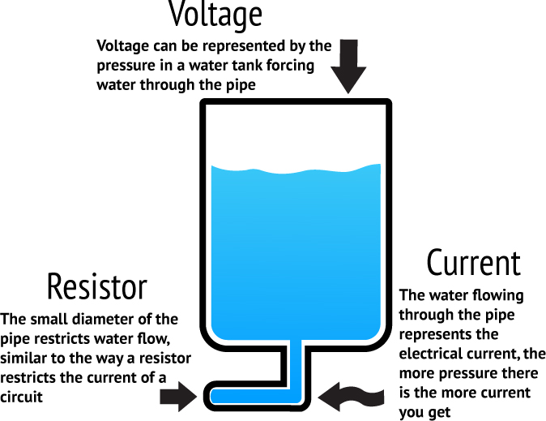
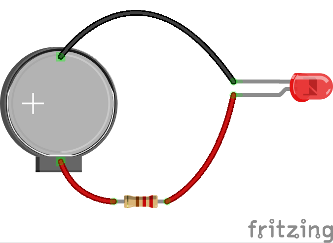
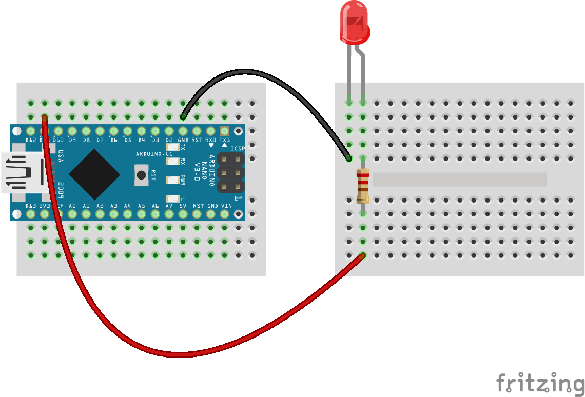
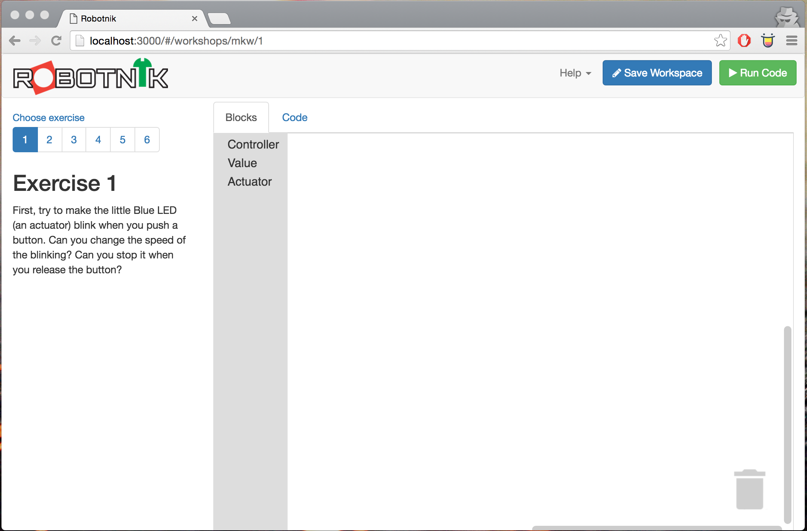

# NodeBots workshop: Societal Relevance STEM event
<!-- .slide: class="title" -->

PWC Melbourne<!-- .element: class="location" -->

Andrew Fisher @ajfisher<!-- .element: class="author" -->

Notes:

Press 'S' for full notes -- .element: class="instruction" --

Hi, my name is Andrew Fisher and I'm an interaction developer and I also build
robots with JavaScript. I am a core member of the NodeBots
project so in my non-work time I look at and build ways to use web
technologies with hardware.

Our workshop today is going to go for about 4 hours and the aim is that by
the end of it, all of you will have built a robot that is controlled from a web
application under your control and you'll be using it to battle each other in a
mini robot sumo battle.

---

## TODO

1. Why NodeBots?
2. Building simple circuits.
3. SumoBot Challenge
4. Break
5. SumoBot Battles

Notes:

Now, I've split things up so there's a little bit of background and theory to get started. Don't
worry, it's all pretty easy going for a Friday arvo and should be things you
probably covered in high school in physics but was not as much fun as this will be.

We'll build some simple circuits together in order to ensure everyone has a minimum
level of electronics knowledge and then I'll introduce you to the software you'll
be using and get you all to build a demo.

After that I'll lay out the the challenge and give you some tips and then it
will be into the build phase in your teams in earnest.

We'll have some food about 6ish so you'll be able to top up for the final push
and look to have our builds done for about 7:20, ready to face off in the ring.

So let's get started.

---

## What are NodeBots?

Notes:

In robotics there's many many ways you can go.

---

## Made in our image
<!-- .slide: data-background="/images/atlas.jpg" -->

ATLAS (C) <!-- .element: class="attribution" -->
[Boston Dynamics](#)

Notes:

From those that look like us and are somewhat creepy.

---

## Explorers
<!-- .slide: data-background="/images/curiosity.jpg" -->

(C) <!-- .element: class="attribution" -->
[NASA](#)

Notes:

To those that are helping humanity reach out into space

---

## Farmer bots
<!-- .slide: data-background="/images/agriculture.jpg" -->

(C) <!-- .element: class="attribution" -->
[GRDC](http://grdc.com.au)

Notes:

To things far more pragmatic like helping in industries such as agriculture
or mining or construction.

---

## The perfect storm for robotics

* Processors approaching near zero cost
* Passable AI for expert systems
* Viable machine learning
* Cheap sensors
* Ubiquitous wireless networks

Notes:

All of this is really worthy stuff and great if you have millions or in some
cases billions of dollars to play with but there are a bunch of overlapping
trends in things like the price of electronics, AI and expert systems, machine learning,
sensor networks, ubiquity of wireless networks that are making now a great time
for robotics specifically but also lots of applications of intelligent, connected,
useful hardware that can be used in many interesting ways.

---

## Web meets the real world
<!-- .slide: data-background="/images/np_glasses.jpg" -->

Glasses (C)<!-- .element: class="attribution" -->
[Andy Gelme](https://twitter.com/geekscape) | 
Image (CC) [Matthew Bergman](7215764961901652://www.flickr.com/photos/matthewbergman/15337663413/)

Notes:

So NodeBots is a global open source project with contributors from all over the
world who are looking at ways to bring the web - one of the most ubiquitous
pieces of interaction technology in history together with hardware. Everything
you'll be using today is a product of that - you'll be programming in a web
browser, running javascript to control a robot.

---

## Is this a robot?
<!-- .slide: data-background="/images/skirt.jpg" -->

NodeSkirt (C)<!-- .element: class="attribution" -->
[Kassandra Perch](https://twitter.com/nodebotanist) |
Image (CC) [Matthew Bergman](https://www.flickr.com/photos/matthewbergman/15969524882/in/set-72157649619016521)

Notes:

We think there's a huge opportunity to bring web tech and hardware together
because the web is the natural interface for many applications of smart tech.

I also believe that the web is highly accessible and is an inclusive community so
provides a great opportunity for people to get involved from non-traditional
robotics backgrounds.

---

nodebotsau.io<!-- .element class="bigtext" -->

Notes:

If you want to know more, visit that link, we run events every month and have
a big international event coming up in July which we'd love to have people
participate in.

---

## First circuits
<!-- .slide: data-background="/images/electronics.jpg" -->

(CC) <!-- .element: class="attribution" -->
[ajfisher](http://twitter.com/ajfisher)

Notes:

Right - so let's get on and start you on your path to build some bots. Now
we are going to have to talk some electronics but I promise it won't take
long and you'll make things at the same time.

We're going to start with an analog circuit - that means no processor involved
then we'll build the same circuit using our processor to control it.

---

### Ohm's Law

(C) <!-- .element: class="attribution" -->
[Tinkernow](http://http://tinkernow.com/)

Notes:

This is the basics of all electronics. Voltage is the pressure of the water
current is how fast it's flowing and resistance is how we change either of these
two things.

---

### Building a throwie
<!-- .slide: data-background="/images/throwie_start.jpg" -->

(CC) <!-- .element: class="attribution" -->
[Grafitti Research Lab](#)

Notes:

This is what we're going to build - a simple LED connected to a battery. IE
the basis of pretty much all modern torches.

---

### Building a throwie

Notes:

An LED needs a resistor or it draws too much current and it will get destroyed.

Like this. //DEMO it with a couple of LEDs.// 

If you really want to break some LEDs then here's a bag and here's a battery.
Just make sure you throw the LEDs out when you're done.

---

### Make the throwie
<!-- .slide: data-background="/images/throwie1.jpg" -->

Notes:

Explain how to make it.

---

### Software controlled light
<!-- .slide: data-background="/images/hello_world.jpg" -->

Notes:

Now we're going to make a similar thing but we'll use a microcontroller and we'll
control this under software control.

---

### Putting it together
<!-- .slide: data-background="/images/breadboard.jpg" -->

(CC) <!-- .element: class="attribution" -->
[ajfisher](http://twitter.com/ajfisher)

Notes:

This is a breadboard. It's used to make temporary connections between wires and
components with the little holes. YOu can see here, the rows are joined together
so any wire in here will be joined together.

---

### Putting it together
<!-- .slide: data-background="/images/arduino_nano.jpg" -->

(CC) <!-- .element: class="attribution" -->
[Phil Farugia](#)

Notes:

This is an arduino - it's a microcomputer. It has only 2K of RAM which isn't
much and it's about the equivalent of a PC from the early 80s. This is what
we'll use to control our circuit. Our computers are going to talk to the arduino
over a USB cable or bluetooth to tell it what to do.

Put the arduino into the breadboard so it's going the same was as the channel
as in this pic. It's easiest if the last pins are right up to the end as well
so you have a couple of rows for space.

So we plug in the arduino into the breadboard over the channel. If you plug it
in the wrong way you'll short circuit it and destroy it so don't do that.

---

### Putting it together

<!-- .element width="60%" -->

Notes:

Now we take an LED and plug that into the other breadboard. Connect a jumper
wire from pin 11 on the arduino to the positive (long) leg of the LED
then connect the short (negative) leg back to a ground on the Arduino.

Plug the usb cable into the computer then plug in the arduino. You should see
the power light turn on. Now we're going to program them.

---

### Blinking an LED

<!-- .element width="50%" -->

Notes:

So this tool is called robotnik - it's a visual programming tool built by some
of the core NodeBots team. Whilst it uses visual blocks to compose programs
in the web browser, it actually writes javascript for you.

On the left are your exercises, we want to start with exercise 1 and go up.

The grey strip is your toolbox that has block in it you can drop onto the work
space. The workspace is your code that is going to be run.

Switch to the demo

---

### Blinking an LED
<!-- .slide: data-background="/images/robotnik.gif" -->

Notes:

So let's make a program. Open up controller and drag the controller block
onto the workspace. On the controller you will see in a minute you have a
joystick to move up down, left right and a red and green button you can press.

You can hook up things to happen when each of those actions are taken.

So now we want our LED which is an actuator so grab that from the actuator shelf
and put it on the top part of the controller block. This is now saying when
the red button is pressed turn the LED on pin 11 ON. That's good, but how do
we turn it off again?

Either grab the block again from the toolbox or right click the one on the worspace
and hit duplicate and drop that in the otherwise section at the bottom.

Now change the drop down menu to set it to turns off.

Once you've done that then check your circuit, make sure the LED is in pin 11
and then hit the save button to save your workspace. Now hit run and you'll
get the controller pop up and if you hit the red button your LED will turn on and
when you release it it will turn off.

I'll give you all a few minutes to make sure you get that working. If you do
then play with your program and try out different things you can do with the LED.

On your computers there is a file in the workshop directory that has some readme
files in it. You can use these to work through the different components in your
kits to learn more to build your bot.

// SHOW THIS

---

## Where are the droids?
<!-- .slide: data-background="/images/droids.jpg" -->

(CC) Flickr <!-- .element: class="attribution" -->
[⣫⣤⣇⣤](http://www.flickr.com/photos/donsolo/3768623542/)

Notes:

So speaking of bots, here's what's going to happen next. Your aim is to build
a bot to compete in a sumobot competition at the end of our session at about
7:20ish.

The ring is here on the floor in front of me.

---

### SumoBot Battle Rules

* Bots can be a max of 25x25x25cm in size.
* Battles last 90 seconds.
* All bots start behind a start line
* Any bot that exits the circle is removed
* Any bot entirely incapacitated at the end is removed
* Referee decision is final

Notes:

Pretty self evident.

---

### Tips

* See workshop/physical/readme.html for design tips
* Split up tasks
* Understand your materials
* Do bluetooth closer to the end
* Keep your battery charged

Notes:

In sumo bot fighting there are 4 core design archetypes. You can blend aspects
of them but these are the main styles. Think about what will work for you and
design accordingly.

You are a team and you need programming, electronics, fabrication and a driver.
All of these tasks are critical - don't ignore any of them - especially driving.

The material we're using is a thing called Corflute - AKA for sale signs, or
right now MP campaigning boards. They are strong and light and flex in one
direction but not the other and you can cut it with a knife or scissors very easily.
If you overlay them with the channels going different directions it will cause
the laminate to stiffen as well so very versatile in making frames for your bots.

In your kits are heaps of cable ties and there's also things like hot glue, serious
tape and other material up here you can use to fabricate with.

Don't go crazy though because your motors have to carry it all so it's a balancing act
between form and weight.

Get the base of your control working over USB and then switch to Bluetooth once
you're confident. Going wireless is fiddly so get other things sorted first.

Finally, keep your battery charged. They don't last forever when you're driving
around and the last thing you want is to go dead when you're in the middle
of the bout. You have a charger for a reason, plug it in and keep it topped up.

---

## Resources

* github.com/ajfisher/robotnik-workshop
* nodebotsau.io
* @nodebotsau
* hackmelbourne.org

Notes:

So if you want to do more and look for more info, here's some places to do so.

---

# NodeBots workshop: Societal Relevance STEM event
<!-- .slide: class="title" -->

PWC Melbourne<!-- .element: class="location" -->

Andrew Fisher @ajfisher<!-- .element: class="author" -->
